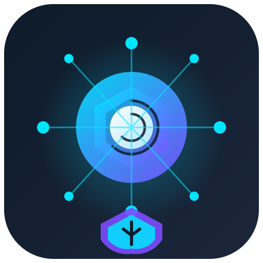

# Agent Company CLI

<p align="center">
  
</p>

<p align="center">
  Governed, visible multi-agent software delivery from a local terminal.
</p>

[](LICENSE)
[](INSTALL.md)
[](INSTALL.md#python-and-mcp-compatibility-runtime)

Agent Company CLI turns a delivery request into a durable run with an explicit
task graph, specialist roles, evidence, budgets, and human approval gates. The
new `@agent-company/cli` v0.2 runtime is written in strict TypeScript. It is a
working vertical slice of the larger Terminal Platform Blueprint, not a claim
that every stable-platform capability in that blueprint is complete.

The existing Python package and MCP server remain in the repository as a
compatibility runtime. Their file-based state and contracts are separate from
the v0.2 TypeScript SQLite state; see [Compatibility](docs/compatibility.md).

## What works in v0.2

- `agent-company init`, `start`/`run`, approval, resume, cancellation, and
  read-only inspection commands.
- A durable SQLite event store in WAL mode with optimistic stream versions and
  idempotent command receipts.
- Canonical run, task, and approval states; a deterministic five-task delivery
  slice; and lazy activation from the 25-role catalog.
- Exact, expiring, single-use approval bindings and A0-A5 policy
  classification for GitHub, Vercel, and Supabase operations.
- Atomic budget reservations, content-addressed SHA-256 artifacts, and scanned
  local attachments that never imply permission to upload.
- Read-only connector discovery through the installed `gh`, `vercel`, and
  `supabase` CLIs. Mutating connector commands currently emit normalized plans;
  they do not silently perform the remote mutation.
- Human, plain, JSON, and NDJSON output modes with stable machine exit codes.
- Authenticated, bounded, four-byte length-framed local IPC over Unix sockets
  or Windows named pipes. The CLI reuses a standalone controller when present
  or starts and closes a one-shot service for the command.
- A deterministic model worker launched in a separate Node process with a
  bound attempt/lease manifest, reduced environment, wall-time/output limits,
  cancellation, and result-binding verification.

## Quick start

Requirements: Node.js 22.13 or newer and npm.

```bash
npm install
npm run build
npm link

mkdir demo-project
cd demo-project
agent-company init
agent-company run --json "Plan and verify a small CLI change"
```

`run` intentionally exits with code `4` because the generated plan needs a
human decision. Continue with the identifiers returned by the CLI:

```bash
agent-company --project . approvals list --json
agent-company --project . approvals approve <approval-id> --reason "Plan reviewed"
agent-company --project . resume <run-id> --json
agent-company --project . events list <run-id> --ndjson
```

For development without linking the executable:

```bash
npm run dev -- init --no-write
npm run dev -- --project ./demo-project runs list --json
```

See [INSTALL.md](INSTALL.md) for Windows, macOS, Linux, package development,
MCP setup, and troubleshooting.

## Safety model

Approval classes describe authority, not just technical difficulty:

| Class | Meaning | Default behavior |
| --- | --- | --- |
| A0 | Observe/read only | May proceed autonomously |
| A1 | Reversible local change | May proceed inside the workspace and policy |
| A2 | Reversible isolated remote change | Exact human approval required |
| A3 | Shared non-production mutation | Exact human approval required |
| A4 | Production or security-sensitive mutation | Exact human approval required |
| A5 | Destructive or irreversible effect | Denied by default; selected operations are hard-denied |

An approval is bound to the actor, connector, action, resource, environment,
artifact digest, and canonical operation hash. A different operation cannot
reuse it, and consumption is atomic. Silence is never consent.

Attachments are local inputs, not upload grants. Ingestion resolves allowed
roots, applies size/count limits, detects common content types, scans for
malware test signatures, likely secrets, PII, and prompt-injection language,
then writes a content-addressed receipt with `transfer_count: 0`.

Read [SECURITY.md](SECURITY.md) and the
[threat model](docs/security/threat-model.md) before enabling a real model or
remote mutation executor.

## Architecture at a glance

```text
Terminal / scripts
        |
        v
CLI and operator console
        |
        | authenticated framed IPC
        v
Controller service (one-shot or standalone)
   |        |          |             |
   v        v          v             v
SQLite   approvals   budgets    worker supervisor
events      |                      child process
   |        v                         |
   +---- policy/tool gateway ---- connector plans
                |
                v
       content-addressed artifacts
```

The exact descriptor, HMAC nonce-proof handshake, four-byte big-endian frame,
and RPC envelopes are documented in
[the IPC protocol note](docs/protocols/local-ipc.md) and
[`schemas/vnext`](schemas/vnext). A standalone controller entry and leased
child-process attempts are implemented. Persistent lease heartbeats, retries,
OS sandboxing, full orphan recovery, and live streaming TUI updates remain
roadmap items.

Detailed component and trust-boundary documentation is in
[Architecture](docs/architecture/architecture.md). Blueprint-to-code status is
tracked without overclaiming in
[Blueprint traceability](docs/blueprint-traceability.md).

## Machine interface

Use `--json` for one result envelope or `--ndjson` for line-oriented output.
Successful values use `agent-company.output/v1`; failures use
`agent-company.error/v1`. Important exit codes are `0` success, `2` usage,
`3` policy denial, `4` approval required, and `10` reconciliation required.
The full ABI is documented in [CLI ABI](docs/protocols/cli-abi.md).

```bash
agent-company version --json
agent-company doctor --json
agent-company integrations catalog --json
agent-company integrations test github --json
agent-company repo push --plan --json
agent-company deploy production my-app --json
agent-company database plan --environment staging --json
```

The final three examples produce plans. They are not remote execution
commands in v0.2.

## Python and MCP compatibility

The Python package remains useful for current prompt-pack and MCP consumers:

```bash
python -m pip install -e ".[mcp]"
python -m unittest discover -s tests -v
python -m agentic_company.mcp_server
```

It exposes the established MCP tools, resources, and prompts over `stdio`,
`sse`, or `streamable-http`. Do not point both runtimes at the same state
directory and expect shared runs: Python uses JSON/JSONL compatibility stores,
while v0.2 uses `.agent-company/state.sqlite`.

## Development

```bash
npm run typecheck
npm run lint
npm test
npm run build
npm run check

python -m unittest discover -s tests -v
python -m compileall -q src tests
```

The vNext schemas are Draft 2020-12 JSON Schemas under
[`schemas/vnext`](schemas/vnext); the existing root schemas remain the Python
compatibility contracts.

## Repository layout

```text
apps/                         CLI, controller service, TUI, worker runtime
packages/                     IPC, worker supervisor, contracts, stores, policy
adapters/                     GitHub, Vercel, and Supabase CLI adapters
schemas/vnext/                TypeScript v0.2 protocol schemas
src/agentic_company/          Python/MCP compatibility runtime
prompts/                      constitution, orchestrator, policies, 25 roles
workflows/                    governed Python compatibility workflows
docs/                         architecture, protocols, security, runbooks
```

## Project status and contribution

v0.2 is an implementation preview. It is suitable for local evaluation and
contract development; it should not be treated as an unattended production
deployment engine. Please read [GOVERNANCE.md](GOVERNANCE.md),
[CONTRIBUTING.md](CONTRIBUTING.md), and [CODE_OF_CONDUCT.md](CODE_OF_CONDUCT.md)
before contributing.

This project is maintained by `khajaaijaz26`. Prompt and blueprint attribution
is preserved in [ATTRIBUTION.md](ATTRIBUTION.md).

Licensed under [Apache-2.0](LICENSE).
