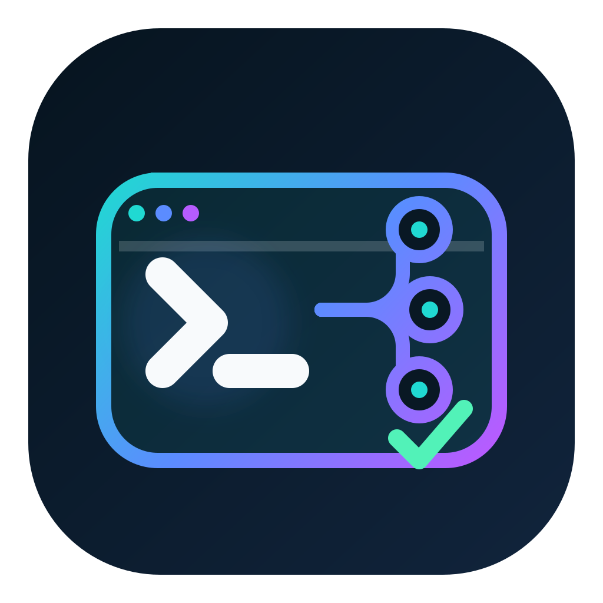
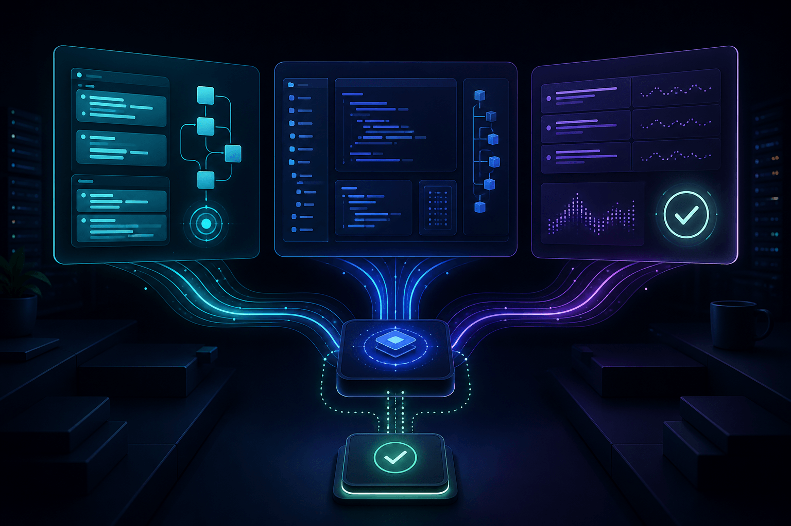
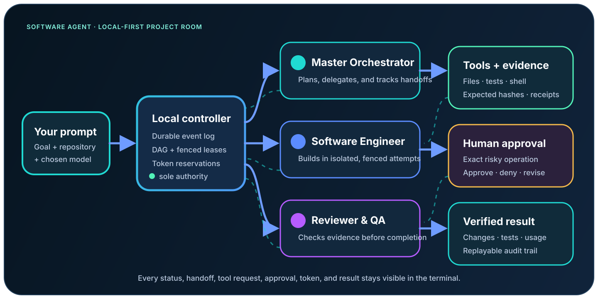

# Software Agent

<p align="center">
  
</p>

<p align="center">
  <strong>A visible team of AI software agents working together in your terminal.</strong>
</p>

<p align="center">
  Plan, implement, review, and verify a repository change while you watch each specialist work, inspect token use, send instructions, and approve exact actions.
</p>

<p align="center">
  <a href="https://github.com/khajaaijaz26/software-agent/releases/latest"></a>
  <a href="https://github.com/khajaaijaz26/software-agent/actions/workflows/ci.yml"></a>
  <a href="LICENSE"></a>
  <a href="INSTALL.md"></a>
</p>



Software Agent is a local-first, event-sourced coding platform—not a single chatbot with several role labels. A durable controller coordinates three logical specialists, streams their activity into a responsive terminal room, protects tools with leases and approvals, and records evidence in SQLite so a run can survive terminal disconnects and controller restarts.

## Install

Requirements: Node.js 22.14 or newer, npm, and Git. Node.js 24 LTS is recommended.

```bash
npm install -g https://github.com/khajaaijaz26/software-agent/releases/download/v0.3.1/software-agent-0.3.1.tgz
software-agent --version
```

This is the verified GitHub `v0.3.1` release asset; GitHub publishes its SHA-256 digest on the release page. The shorter `npm install -g software-agent` command becomes available after the package owner completes npm registry authentication. Contributors can also use the [source installation steps](INSTALL.md#install-from-this-checkout).

## Start in under a minute

Open the repository you want the agents to work on:

```bash
cd path/to/your-project
software-agent
```

The first launch creates private local state in `.software-agent/` and opens the project room. You can also start with an objective:

```bash
software-agent start "Add authentication, tests, and documentation"
```

Without a provider, Software Agent uses its deterministic offline adapter so setup and orchestration can be evaluated safely. To use your own model account, configure only a secret reference—never the raw key.

PowerShell:

```powershell
$env:OPENAI_API_KEY = "your-key"
software-agent providers add openai --model <model-id> --credential env://OPENAI_API_KEY
software-agent providers test openai
software-agent models use openai/<model-id>
software-agent start "Implement the requested change and verify it"
```

macOS or Linux:

```bash
export ANTHROPIC_API_KEY="your-key"
software-agent providers add anthropic --model <model-id> --credential env://ANTHROPIC_API_KEY
software-agent providers test anthropic
software-agent models use anthropic/<model-id>
software-agent start "Implement the requested change and verify it"
```

Run `software-agent setup` at any time to print the secure setup sequence.

## The project room

The terminal UI is designed around work, not chat bubbles. It stays attached to committed controller state and shows the three specialists side by side on wide terminals:

```text
┌ MASTER ORCHESTRATOR ─────┬ SOFTWARE ENGINEER ──────┬ REVIEWER & QA ─────────┐
│ PLANNING                 │ RUNNING                  │ REVIEW                 │
│ maps scope and task DAG  │ search_code → read_file │ tests, risks, evidence │
│ model / tokens / cost    │ files changed / tools   │ independent findings   │
├──────────────────────────┴──────────────────────────┴────────────────────────┤
│ COMMITTED EVENTS          APPROVALS          TOKEN BUDGET: 18,420 / 50,000 │
│ #184 tool.completed       A3 npm test         balanced · 50% mode           │
└──────────────────────────────────────────────────────────────────────────────┘
```

The UI includes responsive wide, medium, narrow, and plain-text layouts; keyboard navigation; event search/follow; targeted instructions; exact approval packets; reconnect/resync states; and a read-only fallback when another terminal owns the mutation lease.

## Why it is different

| Capability | What Software Agent does |
| --- | --- |
| Visible collaboration | Shows which agent owns each task, its current activity, model, tools, files, evidence, blocker, tokens, and cost. |
| Real specialization | Uses durable Master Orchestrator, Software Engineer, and Reviewer & QA sessions with assignments, turns, mailboxes, and handoffs. |
| Safe coding tools | Provides bounded file discovery, token-efficient code search, exact-revision reads, atomic writes, and shell-free verification commands. |
| Human authority | Turns process execution and connected mutations into exact, expiring, single-use approval packets. Silence and `--yes` are never approval. |
| BYOK models | Supports native OpenAI Responses and Anthropic Messages adapters; keys are resolved controller-side from `env://` or supported secure-store references. |
| Lower token use | Defaults to balanced mode at 50% of the full run allowance, with per-agent allocation, reservation, reconciliation, and live usage views. |
| Durable operation | Persists events, command receipts, leases, attempts, budgets, approvals, and evidence in a local SQLite WAL database. |
| Automation-ready | Offers stable human, plain, JSON, and NDJSON outputs plus documented exit codes and JSON Schemas. |

## Governed agent workflow



1. Your objective is committed as a run with a five-task dependency graph.
2. The Master Orchestrator analyzes scope and creates implementation context.
3. The Software Engineer retrieves only relevant repository context, edits through fenced exact-revision writes, and requests approval before running a process.
4. Reviewer & QA works independently and can run in parallel where the graph permits.
5. Handoffs, tool activity, model usage, token reservations, and evidence become replayable events.
6. The controller accepts a result only when its run, task, turn, attempt, lease, revision, and fencing epoch still match.

## Spend fewer tokens deliberately

Software Agent does not promise a fixed percentage reduction in provider billing. It enforces a smaller run allowance and makes usage visible so the team must retrieve and act on relevant context.

| Mode | Effective run allowance | Recommended use |
| --- | ---: | --- |
| `economy` | 25% | Small fixes, focused reviews, constrained budgets |
| `balanced` | 50% | Default for everyday development |
| `quality` | 100% | Large or reasoning-heavy changes |

```bash
software-agent tokens mode balanced
software-agent tokens status
software-agent run --budget economy "Fix the parser regression and add one test"
```

The 50% default is a hard allowance, not a marketing estimate. Provider-reported input, output, cached-input, reasoning, total tokens, and cost are normalized; unknown usage remains `UNKNOWN` rather than being guessed.

## Model and role routing

```bash
software-agent providers list
software-agent models list
software-agent models use openai/<model-id>
software-agent models use anthropic/<model-id> --role reviewer-qa
software-agent secrets list
```

Provider calls happen in the controller. Worker manifests and subprocess environments never contain model credentials. Software Agent uses official API protocols; it does not scrape human-formatted output or reuse private login sessions from Codex, Claude Code, or OpenCode. Optional CLI bridges can be added later only behind explicit, machine-readable capability contracts.

## Approval and tool policy

Risk classes communicate authority:

| Class | Meaning | Default |
| --- | --- | --- |
| A0 | Observe | Allowed inside policy |
| A1 | Local safe operation | Allowed with workspace and lease checks |
| A2 | Workspace mutation | Fenced, exact-revision operation |
| A3 | Process execution | Exact human approval |
| A4 | External write | Exact human approval |
| A5 | Destructive or irreversible | Denied by default; selected operations are hard-denied |

Approvals bind the requesting actor, connector, action, resource, environment, artifact digest, and canonical operation hash. They expire and can be consumed only once. Command arguments that resemble credentials are denied before process creation.

Read [SECURITY.md](SECURITY.md) and the [threat model](docs/security/threat-model.md) before enabling real providers or connected mutations.

## Architecture

```text
Ink terminal room / JSON automation
                │ authenticated framed IPC
                ▼
       local controller daemon
       ├─ durable scheduler + sessions + handoffs
       ├─ model broker ─ OpenAI / Anthropic / deterministic
       ├─ token ledger + secret broker
       ├─ approval + policy boundary
       ├─ workspace tools + disposable attempts
       └─ SQLite WAL events / receipts / evidence
```

Important implementation details:

- Four-byte length-framed JSON over a Unix socket or Windows named pipe; no TCP fallback.
- Workspace/user/instance-bound descriptor, private nonce, HMAC proof, frame limits, and correlated typed RPC.
- Detached controller discovery with cross-process start locking and stale-process recovery.
- Idempotent commands, optimistic revisions, mutation leases, attempt fencing, cancellation, bounded output, and restart replay.
- Draft 2020-12 contracts in [`schemas/vnext`](schemas/vnext).

See [Architecture](docs/architecture/architecture.md), [local IPC](docs/protocols/local-ipc.md), and [blueprint traceability](docs/blueprint-traceability.md).

## Useful commands

```bash
software-agent                         # open or create the local project room
software-agent start "your objective" # create a run and watch it live
software-agent run --json "objective" # headless/machine flow
software-agent runs list
software-agent tasks graph
software-agent approvals list
software-agent tokens status
software-agent changes diff
software-agent doctor --json
software-agent commands model
```

GitHub, Vercel, and Supabase adapters currently provide read-only discovery and governed mutation plans. Remote mutation execution remains intentionally disabled until its receipt/reconciliation path is complete.

## What “context retrieval” means here

The coding runtime has bounded repository listing, literal code search, and exact file reads. It uses those tools to select relevant context instead of injecting an entire repository into every prompt. This release does not claim embedding/vector RAG, a language server, or a semantic code index. Those can be optional modules later without making the base install heavy or sending source code to a separate indexing service.

## Install from source and contribute

```bash
git clone https://github.com/khajaaijaz26/software-agent.git
cd software-agent
npm ci
npm run check
npm link
software-agent --version
```

The primary platform is TypeScript. A separately named Python/MCP compatibility runtime remains for existing integrations and does not share controller state. See [INSTALL.md](INSTALL.md), [Compatibility](docs/compatibility.md), [CONTRIBUTING.md](CONTRIBUTING.md), and [GOVERNANCE.md](GOVERNANCE.md).

## Current boundaries

Software Agent v0.3 is a local developer preview. It has no OS-level sandbox or Windows named-pipe peer-SID verification, no vector RAG index, no signed event export, and no enabled remote mutation executor. Treat model output and repository content as untrusted. Review changes and approvals before relying on results.

Visual assets are original to this repository; generation and composition details are recorded in [asset provenance](docs/assets/PROVENANCE.md).

Licensed under [Apache-2.0](LICENSE).
