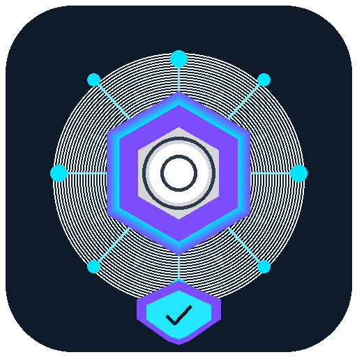

# Open-Source Agentic Software Company



<br clear="both"/>

[](https://opensource.org/licenses/Apache-2.0)
[](https://www.python.org/downloads/)
[](https://github.com/khajaaijaz26/agentic-software-company/actions)
[](https://github.com/khajaaijaz26/agentic-software-company/actions)
[-purple.svg)](https://github.com/khajaaijaz26/agentic-software-company)
[](https://github.com/khajaaijaz26/agentic-software-company/pulls)
[](https://github.com/khajaaijaz26/agentic-software-company/issues)
[](https://github.com/khajaaijaz26/agentic-software-company/stargazers)

---

## 🏢 About

A governed, multi-agent software delivery platform. This repository is the **reference implementation** of the **Open-Source Agentic Software Company Master System Prompt** (v1.0, 17 August 2026): a blueprint for a coordinated team of specialist AI agents that plan, build, review, test, secure, deploy, and support software — under explicit human authority, policy control, and full audit.

Everything in this repo — the prompt library, JSON schemas, YAML workflows, policies, a dependency-free Python reference implementation, and a **universal MCP server** — is open source under the Apache-2.0 license.

> **New in 1.0**: a single universal MCP server (`src/agentic_company/mcp_server.py`) exposes the whole platform to **any** MCP-capable AI coding agent, IDE, or terminal over `stdio`, `sse`, or `streamable-http`. See [INSTALL.md](INSTALL.md) for the complete step-by-step setup.

---

## 🔥 Features

| Feature | Description |
|---------|-------------|
| **25 Specialist Role Prompts** | Extracted verbatim from the master doc: client-intake-account, sales-qualification, discovery-business-analyst, product-manager, project-manager, ux-researcher, ux-ui-designer, solution-architect, risk-compliance-advisor, finops-commercial, technical-lead, frontend-engineer, backend-engineer, data-database-engineer, integration-engineer, code-reviewer, qa-strategist, test-automation-engineer, security-engineer, performance-reliability, devops-platform, release-manager, sre-incident-manager, technical-writer, customer-support-success |
| **Five Governance Layers** | Base Agent Constitution, Project Policy, Production Policy, Data Handling Policy, and Approval Gating (G0–G4) |
| **Deterministic Policy Engine** | Maps operations to approval gates (G0=read-only, G1=reversible workspace, G2=shared/non-prod, G3=production/sensitive, G4=irreversible/high-impact); environment escalation (e.g. workspace edits in prod auto-upgrade to G3) |
| **Bound & Short-Lived Approvals** | Single-use approval tokens bound to actor, action, resource, environment, artifact sha, and project; silence is never consent |
| **Full Audit Trail** | Append-only event store with immutable domain events; every tool call, approval, and handoff is recorded |
| **Content-Addressed Artifacts** | SHA-256 content-addressed storage with path-traversal protection |
| **Universal MCP Server** | One server, three transports (`stdio`, `sse`, `streamable-http`): 8 tools, 6 resource templates, and 2 pre-assembled prompts for any MCP-capable agent |
| **Dependency-Free Core** | Reference implementation using only the Python standard library; the MCP adapter is an optional extra |
| **Four YAML Workflows** | Delivery pipeline, change-control classification, production release gating, incident response |
| **JSON Schemas** | 6 canonical schemas: project, event, capability, task/result/approval envelopes (mirrors in `src/agentic_company/contracts.py`) |
| **Full Eval Suite** | Delivery scenario + structured rubrics under `evals/` |

---

## 🚀 Quick Start (Universal Terminal)

The platform runs on Python 3.10+ with the standard library only. All commands assume you are in the repository root.

### 1. Set up the platform

```bash
# Method 1: Install the package in development mode (recommended)
python -m pip install -e .

# Method 2: Set PYTHONPATH (no install)
export PYTHONPATH=src            # bash / zsh / macOS / Linux
# PowerShell: $env:PYTHONPATH = "src"
```

### 2. Run the test suite

```bash
python -m unittest discover -s tests -v
# → 48 tests pass (including the MCP adapter integration tests)
```

### 3. Initialize a project

```bash
python -m agentic_company init-project "DemoApp" "carol" --goal "ship v1"
# → proj_a1effd13844a
```

### 4. Dispatch a specialist

```bash
python -m agentic_company dispatch technical-lead "design the architecture"
# → task_32d15eeb9d1d COMPLETE
```

### 5. Audit a project's event trail

```bash
python -m agentic_company audit proj_a1effd13844a
# → Prints one event line per dispatch/approval/handoff
```

### 6. Run the delivery eval scenario

```bash
python evals/scenarios/delivery_cli.py
# → SCENARIO PASSED
```

### 7. Full compile/check

```bash
python -m compileall -q src tests
```

---

## 🔌 Universal MCP Server

The platform ships one MCP server that works with **every** MCP-compatible
AI coding agent, IDE, and terminal — nothing platform-specific inside.

### What it exposes

| Capability | Details |
|------------|---------|
| **8 Tools** | `begin_project`, `assign_task`, `complete_task`, `request_approval`, `resolve_approval`, `audit`, `list_roles`, `list_workflows` |
| **6 Resource Templates** | `prompts://roles/{role}`, `prompts://policies/{policy}`, `schemas://{schema}`, `workflows://{workflow}`, plus the constitution and master orchestrator |
| **2 Prompts** | `act_as_role(role)`, `conduct_code_review` |
| **3 Transports** | `stdio` (local), `sse` (remote), `streamable-http` (remote/container) |

### Run it

```bash
# stdio (local agents / IDEs)
python -m agentic_company.mcp_server

# remote, over HTTP — reachable from any platform on any machine
python -m agentic_company.mcp_server --transport streamable-http --mount-path /mcp

# or containerized (universal remote endpoint)
docker build -t agentic-company-mcp .
docker run -p 8000:8000 agentic-company-mcp   # → http://localhost:8000/mcp
```

### Connect it

Each platform needs a tiny connection snippet — all pointing at the **same**
server. Ready-made files for Claude Code, Codex, Cursor, VS Code, Claude
Desktop, Windsurf, OpenCode, and remote HTTP live in [`configs/`](configs/).
The project-scoped `.mcp.json` is already committed for platforms that read it.

> 📘 **Full step-by-step installation & integration for every platform is in
> [INSTALL.md](INSTALL.md).**

---

## 🤖 Integration with AI Coding Assistants (Universal)

Any LLM-based coding assistant can act as a **specialist agent** by consuming
the prompt files and routing work through the **task envelope** / **result
envelope** contract.

### The general pattern (assistant-agnostic)

1. **Load the Base Constitution** — `prompts/base-agent-constitution.md` sets the mandatory operating rules every agent must follow.
2. **Select a Role Prompt** — choose from `prompts/roles/` matching the agent's function (25 options).
3. **Compose Instructions** — combine the constitution + role + project policy + task envelope context.
4. **Tool Authorization** — before any tool invocation, classify the operation via the policy engine logic (G0–G4 gates); require a bound, short-lived approval token for G2–G4 actions; enforce path safety and redaction as described in the constitution.
5. **Record Handoffs** — every agent output, tool call, and approval decision should be logged as an immutable domain event for audit continuity.
6. **Result Envelope** — the agent returns a structured result containing: status, summary, evidence (criterion outcomes with proofs), artifacts, budget usage, and the next owner/action.

The envelope formats live under `prompts/templates/` and their canonical
schemas under `schemas/`. Any assistant can validate requests/responses
against these schemas.

### Two integration styles

**A. MCP (recommended, zero-config)** — point your agent at the universal MCP
server and it automatically gains the tools, prompts, and schemas. See
[INSTALL.md](INSTALL.md) for platform-by-platform snippets.

**B. Prompt pack (copy-paste)** — share the `prompts/` directory with the
assistant and wire the envelope pattern yourself:

```python
from agentic_company.state_store import StateStore
from agentic_company.event_store import EventStore
from agentic_company.orchestrator import Orchestrator
from agentic_company.approval_service import ApprovalService
from agentic_company.agent_registry import AgentRegistry, AgentSpec
from agentic_company.policy_engine import PolicyEngine

state = StateStore(path=".agentic_company/state.json")
events = EventStore(path=".agentic_company/events.jsonl")
registry = AgentRegistry()
for role in ("client-intake-account", "technical-lead", "backend-engineer"):
    registry.register(AgentSpec(role=role, prompt_file=f"prompts/roles/{role}.md", prompt_sha=f"sha-{role}"))

policy = PolicyEngine()
approvals = ApprovalService()
orchestrator = Orchestrator(state=state, events=events, policy=policy, approvals=approvals, registry=registry, dispatcher=_my_dispatcher)

# Begin a project
project = orchestrator.begin_project(
    request="build a CLI tool",
    name="my-cli",
    owner="alice",
    scope_goals=["summarize a repo"],
    scope_non_goals=[],
    acceptance_criteria=["CLI exits 0"],
)

# Dispatch a task
result = orchestrator.dispatch(
    project=project,
    agent_role="technical-lead",
    kind="delivery",
    instructions="design the architecture",
)
```

### What "automatic setup" looks like

1. Clone this repo (or add it as a dependency).
2. Install the package + MCP extra (`python -m pip install -e ".[mcp]"`).
3. Add the connection snippet for your platform from [INSTALL.md](INSTALL.md).
4. Your agent now has governed project management, specialist role prompts,
   approval gating, and audit — ready to run.

---

## 🛠️ Development

| Goal | Command |
|------|---------|
| Install package + MCP extra (dev) | `python -m pip install -e ".[mcp]"` |
| Run all tests | `python -m unittest discover -s tests -v` |
| Lint / compile check | `python -m compileall -q src tests` |
| Validate JSON schemas parse | `python -c "import glob, json; [json.load(open(p,encoding='utf-8')) for p in glob.glob('schemas/*.json')]; [json.load(open(p,encoding='utf-8')) for p in glob.glob('prompts/templates/*.json')]; print('JSON OK')"` |
| Verify prompt-library completeness | `python -c "import pathlib; r=list(pathlib.Path('prompts/roles').glob('*.md')); assert len(r)==25, len(r); assert pathlib.Path('prompts/master-orchestrator.md').exists(); print('prompts OK')"` |
| Run the delivery eval scenario | `python evals/scenarios/delivery_cli.py` |
| Initialize a project via CLI | `python -m agentic_company init-project "Name" "owner" --goal "goal"` |
| Dispatch a specialist via CLI | `python -m agentic_company dispatch <role> "<instructions>"` |
| Audit a project via CLI | `python -m agentic_company audit <project_id>` |
| Run the MCP server (stdio) | `python -m agentic_company.mcp_server` |
| Run the MCP server (HTTP) | `python -m agentic_company.mcp_server --transport streamable-http --mount-path /mcp` |

---

## 📁 Repository Layout

```
├─ .github/
│  ├─ workflows/ci.yml        # CI: install + test + compile + schema validate + prompt completeness
│  └─ ISSUE_TEMPLATE/         # Bug report & feature request templates
├─ assets/
│  ├─ logo.png                # Project logo (PNG)
│  └─ logo.svg                # Project logo (vector source)
├─ configs/                   # Universal MCP config files per platform
│  ├─ opencode.jsonc
│  ├─ codex-config.toml
│  ├─ cursor-mcp.json
│  ├─ vscode-mcp.json
│  ├─ claude-desktop-config.json
│  └─ windsurf-mcp.json
├─ docs/
│  ├─ architecture/architecture.md
│  ├─ adr/0001-initial-architecture.md
│  └─ runbooks/local-development.md
├─ evals/scenarios/delivery_cli.py
├─ prompts/
│  ├─ base-agent-constitution.md   # Mandatory foundation
│  ├─ master-orchestrator.md       # Orchestrator prompt (verbatim)
│  ├─ roles/                       # 25 specialist agent prompts
│  ├─ policies/                    # Project / Production / Data-handling policies
│  └─ templates/                   # Task / Result / Approval envelope JSON
├─ schemas/                        # 6 canonical JSON schemas
├─ src/agentic_company/
│  ├─ __main__.py                  # CLI entry point
│  ├─ mcp_server.py                # Universal MCP server (stdio/sse/http)
│  ├─ orchestrator.py, policy_engine.py, approval_service.py
│  ├─ tool_gateway.py, agent_registry.py, workflow.py
│  ├─ state_store.py, event_store.py, artifact_store.py
│  └─ contracts.py
├─ tests/                          # 48 tests (incl. MCP adapter)
├─ workflows/                      # delivery, change-control, release, incident
├─ INSTALL.md                      # Step-by-step install & integration for every platform
├─ Dockerfile                      # Containerized universal MCP server
├─ pyproject.toml                  # Build metadata + optional mcp extra
└─ LICENSE, README.md, SECURITY.md, CONTRIBUTING.md, GOVERNANCE.md,
   CODE_OF_CONDUCT.md, CHANGELOG.md, ATTRIBUTION.md
```

---

## 📄 License

[Apache-2.0](https://opensource.org/licenses/Apache-2.0) — See [LICENSE](LICENSE).

---

## 👐 Contributing

Please read [CONTRIBUTING.md](CONTRIBUTING.md), [GOVERNANCE.md](GOVERNANCE.md), and [CODE_OF_CONDUCT.md](CODE_OF_CONDUCT.md) before opening an issue or pull request.

We work in small reversible steps, add or update tests, and never commit secrets.