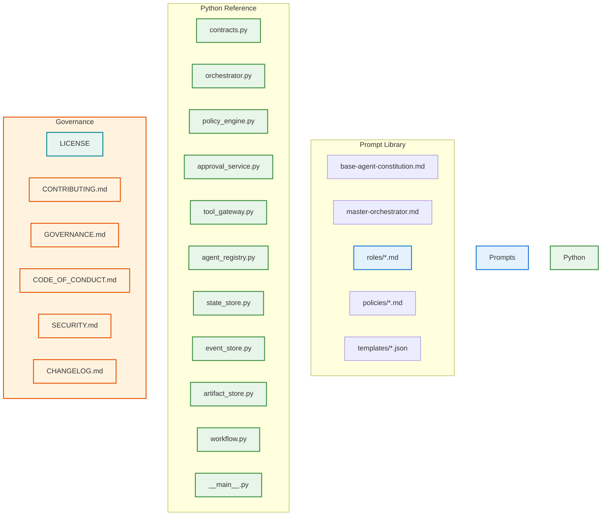

# Open-Source Agentic Software Company

[](https://opensource.org/licenses/Apache-2.0)
[](https://www.python.org/downloads/)
[](https://github.com/khajaaijaz26/agentic-software-company/actions)
[](https://github.com/khajaaijaz26/agentic-software-company/actions)
[](https://github.com/khajaaijaz26/agentic-software-company/pulls)
[](https://github.com/khajaaijaz26/agentic-software-company/issues)
[](https://github.com/khajaaijaz26/agentic-software-company/stargazers)

---

## 🏢 About

A governed, multi-agent software delivery platform. This repository is the **reference implementation** of the **Open-Source Agentic Software Company Master System Prompt** (v1.0, 17 August 2026): a blueprint for a coordinated team of specialist AI agents that plan, build, review, test, secure, deploy, and support software — under explicit human authority, policy control, and full audit.

Everything in this repo — the prompt library, JSON schemas, YAML workflows, policies, and a dependency-free Python reference implementation — is open source under the Apache-2.0 license.

---

## 🔥 Features

| Feature | Description |
|---------|-------------|
| **25 Specialist Role Prompts** | Extracted verbatim from the master doc: client-intake-account, sales-qualification, discovery-business-analyst, product-manager, project-manager, ux-researcher, ux-ui-designer, solution-architect, risk-compliance-advisor, finops-commercial, technical-lead, frontend-engineer, backend-engineer, data-database-engineer, integration-engineer, code-reviewer, qa-strategist, test-automation-engineer, security-engineer, performance-reliability, devops-platform, release-manager, sre-incident-manager, technical-writer, customer-support-success |
| **Five Governance Layers** | Base Agent Constitution, Project Policy, Production Policy, Data Handling Policy, and Approval Gating (G0–G4) |
| **Deterministic Policy Engine** | Maps operations to approval gates (G0=read-only, G1=reversible workspace, G2=shared/non-prod, G3=production/sensitive, G4=irreversible/high-impact); environment escalation (e.g. workspace edits in prod auto-upgrade to G3) |
| **Bound & Short-Lived Approvals** | Single-use approval tokens bound to actor, action, resource, environment, artifact sha, and project; silence is never consent |
| **Full Audit Trail** | Append-only event store with immutable domain events; every tool call, approval, and handoff is recorded |
| **Content-Addressed Artifacts** | SHA-256 content-addressed storage with path-traversal protection |
| **Dependency-Free Python** | Reference implementation using only the Python standard library (`unittest` tests only; no pip install required) |
| **Four YAML Workflows** | Delivery pipeline, change-control classification, production release gating, incident response |
| **JSON Schemas** | 6 canonical schemas: project, event, capability, task/result/approval envelopes (mirrors in `src/agentic_company/contracts.py`) |
| **Full Eval Suite** | 1 delivery scenario + structured rubrics under `evals/` |

---

## 🚀 Quick Start (Universal Terminal)

The platform runs on Python 3.10+ with the standard library only. All commands assume you are in the repository root.

### 1. Set up the Python path

```bash
# Method 1: Install the package in development mode
python -m pip install -e .

# Method 2: Set PYTHONPATH
export PYTHONPATH=src
```

### 2. Run the test suite

```bash
python -m unittest discover -s tests -v
# → 43 tests pass
```

### 3. Initialize a project

```bash
python -m agentic_company init-project "DemoApp" "carol" --goal "ship v1"
# → proj_a1effd13844a
```

### 4. Dispatch a specialist

```bash
python -m agentic_company dispatch technical-lead "design the architecture"
# → task_32d15eeb9d1d COMPLETE
```

### 5. Audit a project's event trail

```bash
python -m agentic_company audit proj_a1effd13844a
# → Prints one event line per dispatch/approval/handoff
```

### 6. Run the delivery eval scenario

```bash
python evals/scenarios/delivery_cli.py
# → SCENARIO PASSED
```

### 7. Full compile/check

```bash
python -m compileall -q src tests
```

---

## 📦 Integration with AI Coding Assistants

This platform is designed so any LLM-based coding assistant can act as a **specialist agent** by consuming the prompt files and routing work through the **task envelope** / **result envelope** contract.

### General Integration Pattern

1. **Load the Base Constitution** — the file `prompts/base-agent-constitution.md` sets the mandatory operating rules every agent must follow.
2. **Select a Role Prompt** — choose from `prompts/roles/` matching the agent's function (25 options).
3. **Compose Instructions** — combine the constitution + role + project policy + task envelope context.
4. **Tool Authorization** — before any tool invocation, classify the operation via the policy engine logic (G0–G4 gates); require a bound, short-lived approval token for G2–G4 actions; enforce path safety and redaction as described in the constitution.
5. **Record Handoffs** — every agent output, tool call, and approval decision should be logged as an immutable domain event for audit continuity.
6. **Result Envelope** — the agent returns a structured result containing: status, summary, evidence (criterion outcomes with proofs), artifacts, budget usage, and the next owner/action.

The envelope formats live under `prompts/templates/` and their canonical schemas under `schemas/`. Any assistant can validate requests/responses against these schemas.

### MCP Server Setup (Universal)

If you want to serve the prompt library and schemas via an MCP server so any agent can discover and version the library:

1. **Serve the resources** — the MCP server should expose three endpoint types:
   - `GET /prompts/base-agent-constitution.md`
   - `GET /prompts/roles/<name>.md`
   - `GET /schemas/<name>.json`
2. **Authentication** — use your preferred method (API key, OAuth, bearer tokens). The server must validate that the requesting agent has permission to read the requested prompt/schema.
3. **Catalog metadata** — publish a machine-readable catalog at the server root listing all available prompts, their versions (SHA-256 of file content), and associated policies.
4. **Example minimal MCP config** (adapt to your MCP framework):

```json
{
  "servers": {
    "agentic-prompt-lib": {
      "command": "python",
      "args": ["-m", "agentic_company.mcp_adapter"],
      "env": {
        "PROMPTS_ROOT": "/path/to/agentic-software-company/prompts"
      }
    }
  }
}
```

The `agentic_company.mcp_adapter` module should read the prompt files and schemas from `PROMPTS_ROOT` and serve them via HTTP with proper content-type headers and authentication checking.

### Manual Terminal (No LLM Assistant)

All functionality is callable directly from Python:

```python
from agentic_company.state_store import StateStore
from agentic_company.event_store import EventStore
from agentic_company.orchestrator import Orchestrator
from agentic_company.approval_service import ApprovalService
from agentic_agent_registry import AgentRegistry

state = StateStore(path=".agentic_company/state.json")
events = EventStore(path=".agentic_company/events.jsonl")
registry = AgentRegistry()
for role in ("client-intake-account", "technical-lead", ...):
    registry.register(AgentSpec(role=role, prompt_file=f"prompts/roles/{role}.md", prompt_sha=f"sha-{role}"))

policy = PolicyEngine()
approvals = ApprovalService()
orchestrator = Orchestrator(state=state, events=events, policy=policy, approvals=approvals, registry=registry, dispatcher=_my_dispatcher)

# Begin a project
project = orchestrator.begin_project(
    request="build a CLI tool",
    name="my-cli",
    owner="alice",
    scope_goals=["summarize a repo"],
    scope_non_goals=[],
    acceptance_criteria=["CLI exits 0"],
)

# Dispatch a task
result = orchestrator.dispatch(
    project=project,
    agent_role="technical-lead",
    kind="delivery",
    instructions="design the architecture",
)
```

---

## 🏗️ Architecture



---

## 📁 Repository Layout

```
├─ .github/
│  └─ workflows/
│     ├─ ci.yml            # CI: install + test + compile + schema validate + prompt completeness
│     ├─ delivery.yaml     # Delivery pipeline workflow
│     ├─ change-control.yaml
│     ├─ release.yaml
│     └─ incident.yaml
├─ ATTRIBUTION.md         # Attribution of extracted prompts
├─ CHANGELOG.md          # Version history
├─ CODE_OF_CONDUCT.md
├─ CONTRIBUTING.md       # How to contribute
├─ docs/
│  ├─ architecture/
│  │   └─ architecture.md   # High-level architecture
│  ├─ adr/
│  │   └─ 0001-initial-architecture.md   # Architecture decision record
│  ├─ protocols/
│  │   └─ ...              # Protocol notes
│  ├─ runbooks/
│  │   └─ local-development.md   # Local dev runbook
│  ├─ security/
│  │   └─ ...              # Security posture
│  └─ contributing/
│      └─ ...              # Contribution guide
├─ evals/
│  └─ scenarios/
│     └─ delivery_cli.py   # End-to-end delivery scenario
├─ .gitignore
├─ LICENSE               # Apache-2.0
├─ pyproject.toml        # Build metadata (setuptools, package‑dir)
├─ prompts/
│  ├─ base-agent-constitution.md           # Mandatory foundation
│  ├─ master-orchestrator.md               # Orchestrator prompt (verbatim)
│  ├─ roles/                               # 25 specialist agent prompts
│  ├─ policies/                            # Project / Production / Data‑handling policies
│  └─ templates/                           # Task / Result / Approval envelope JSON schemas
├─ prompts/system/   # Pre‑seeded scaffold (duplicates canonical prompts)
│   ├─ base-agent-constitution.md
│   ├─ master-orchestrator.md
│   ├─ agents/   # 3 sample agent prompt markdown files
│   └─ schemas/
│     └─ task/                             # task-envelope-v1.json
├─ prompts/roles/      # ← canonical 25 role prompt markdown files
├─ prompts/policies/   # ← canonical 3 policy markdown files
├─ prompts/templates/  # ← canonical envelope JSON files
├─ pyproject.toml
├─ README.md
├─ schemas/
│  ├─ project.schema.json
│  ├─ event.schema.json
│  ├─ capability.schema.json
│  ├─ task-envelope.schema.json
│  ├─ result-envelope.schema.json
│  └─ approval-request.schema.json
├─ scripts/            # Helper scripts (optional)
├─ src/
│  └─ agentic_company/
│     ├─ __init__.py
│     ├─ __main__.py      # CLI entry point
│     ├─ agent_registry.py
│     ├─ approval_service.py
│     ├─ artifact_store.py
│     ├─ contracts.py
│     ├─ event_store.py
│     ├─ orchestrator.py
│     ├─ policy_engine.py
│     ├─ state_store.py
│     ├─ tool_gateway.py
│     └─ workflow.py
├─ tests/
│  ├─ test_contracts.py
│  ├─ test_policy_approval.py
│  ├─ test_stores.py
│  ├─ test_orchestrator_gateway.py
│  └─ test_workflow_registry.py
└─ workflows/
   ├─ delivery.yaml
   ├─ change-control.yaml
   ├─ release.yaml
   └─ incident.yaml
```

---

## 🛠️ Development

| Goal | Command |
|------|---------|
| Install package (dev mode) | `python -m pip install -e .` |
| Run all tests | `python -m unittest discover -s tests -v` |
| Lint / compile check | `python -m compileall -q src tests` |
| Validate JSON schemas parse | `python -c "import glob, json; [json.load(open(p,encoding='utf-8')) for p in glob.glob('schemas/*.json')]; [json.load(open(p,encoding='utf-8')) for p in glob.glob('prompts/templates/*.json')]; print('JSON OK')"` |
| Verify prompt-library completeness | `python -c "import pathlib; r=list(pathlib.Path('prompts/roles').glob('*.md')); assert len(r)==25, len(r); assert pathlib.Path('prompts/master-orchestrator.md').exists(); print('prompts OK')"` |
| Run the delivery eval scenario | `python evals/scenarios/delivery_cli.py` |
| Initialize a project via CLI | `python -m agentic_company init-project "Name" "owner" --goal "goal"` |
| Dispatch a specialist via CLI | `python -m agentic_company dispatch <role> "<instructions>"` |
| Audit a project via CLI | `python -m agentic_company audit <project_id>` |

---

## 📄 License

[Apache-2.0](https://opensource.org/licenses/Apache-2.0) — See [LICENSE](LICENSE).

---

## 👐 Contributing

Please read [CONTRIBUTING.md](CONTRIBUTING.md), [GOVERNANCE.md](GOVERNANCE.md), and [CODE_OF_CONDUCT.md](CODE_OF_CONDUCT.md) before opening an issue or pull request.

We work in small reversible steps, add or update tests, and never commit secrets.